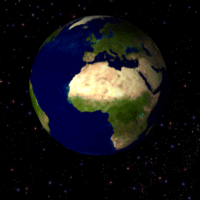

# Overview

This is a library to get loop counts of gifs.

As gif parsing library, use [https://github.com/buzzfeed/libgif-js](https://github.com/buzzfeed/libgif-js).

# Example

```
  
  <p><span>0</span> loops</p>
  <script>
  $('img').each(function (i,img_tag) {
    if (/.*\.gif/.test(img_tag.src)) {
      var lcg = new loopCountableGif({
        gif: img_tag,
        on_end: function(){
          $('span').text(lcg.current_loops());
        }
      });
      lcg.load();
    }
  });
  </script>
```


# Constructor options
- gif
  - Required. The DOM element of an img tag.
- on_end
  - Optional. Add a callback which is executed each gif loop ends.

# Instance methods
- load
  - Loads a image and calls callback.
- current_loops
  - Get current loop counts.
- reset_local_loops
  - Reset current loop counts.

# Caveat: same-domain origin

The gif has to be on the same domain (and port and protocol) as the page you're loading.

The library works by parsing gif image data in js, extracting individual frames, and rendering them on a canvas element. There is no way to get the raw image data from a normal image load, so this library does an XHR request for the image and forces the MIME-type to "text/plain". Consequently, using this library is subject to all the same cross-domain restrictions as any other XHR request.